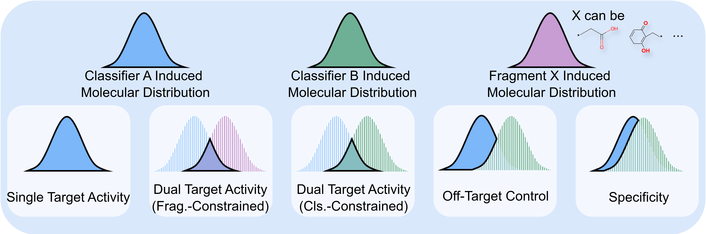

# ActivityDiff

Classifier-guided molecular generation using diffusion models. ActivityDiff enables precise control over molecular biological activity, including targeted activation/inhibition, cooperative multi-target modulation, and off-target toxicity mitigation for de novo drug design.

<div align="center">
  
</div>

## Quick Start

### 1. Installation

```bash
git clone https://github.com/your-username/ActivityDiff.git
cd ActivityDiff

# Create conda environment
conda env create -f environment.yaml
conda activate activitydiff
```

### 2. Download Pre-trained Models

Download the pre-trained models from [Releases](https://github.com/e-yi/ActivityDiff/releases/tag/v1) and place them in the project root:

- `epoch_064.ckpt` - Pre-trained diffusion model
- `P15056.pth` - P15056 activity classifier
- `Q02750.pth` - Q02750 activity classifier

### 3. Run Demo

```bash
jupyter notebook main_demo.ipynb
```

The demo includes:

- **P15056 guided generation** - Generate molecules with P15056 activity
- **Q02750 fragment-based design** - Generate molecules from fragments with Q02750 activity
- **Visualization and analysis** - View generated molecules and their properties

----

This repository is built upon the [lightning-hydra-template](https://github.com/ashleve/lightning-hydra-template).
